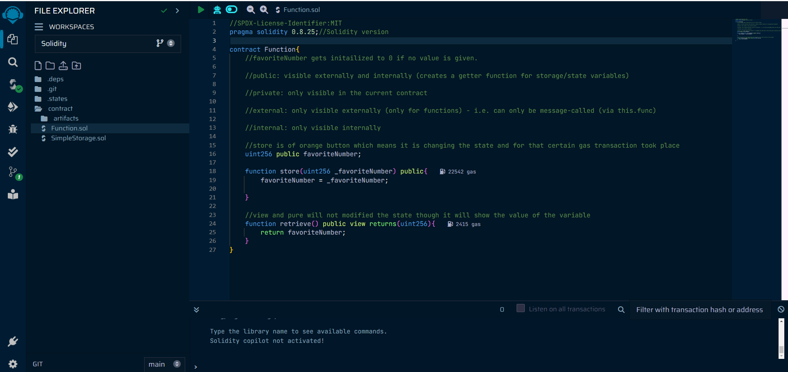
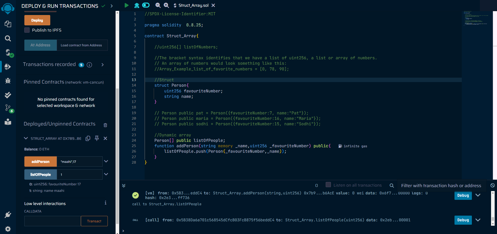

# 🚀Solidity from Basics

## Introduction🔥

➡️Welcome to the Solidity from Basics course! In this series of lectures, we'll walk you through the fundamentals of Solidity, the programming language used for developing smart contracts on the Ethereum blockchain. Let's dive in!

## Lecture 0: Remix IDE

### Overview
- Remix IDE is a powerful tool for building and developing smart contracts in Solidity.
- It provides features like a file explorer, Solidity compiler, and contract deployment capabilities.

### Getting Started
- Open Remix IDE.
- Optionally, remove existing files and folders.
- Create a new file with a .sol extension, e.g., SimpleStorage.sol.

### Compiler Directive
- Use the `pragma solidity` directive to specify the Solidity compiler version.
- Options include using a single version or a range of versions.

### SPDX License Identifier
- It's good practice to include an SPDX-License-Identifier at the beginning of your smart contract.
- SPDX identifiers help in licensing and sharing code.

### Writing the Smart Contract
- Define your contract using the `contract` keyword followed by a name.
- Think of a contract as similar to a class in Object-Oriented Programming.

### Compiling the Contract
- Use the Solidity Compiler tab to compile your code.
- Ensure the compiler version matches the one specified in your Solidity file.
- Successful compilation results in bytecode generation.

## Lecture 1: Solidity Types🔥

### Elementary Types
- Solidity supports various elementary types such as Boolean, Unsigned Integer, Integer, Address, and Bytes.
- These types can be combined to create more complex data structures.

### Variables Definition
- Variables are just placeholders for values. A value can be one data type described in the table. For instance, we could create a Boolean variable named hasFavoriteNumber, which would represent whether someone has a favourite number or not (true or false).
- > bool hasFavoriteNumber = true;

### Example Contract
```solidity
// SPDX-License-Identifier: MIT
pragma solidity 0.8.19;

contract SimpleStorage {
    // Basic types
    bool hasFavoriteNumber = true;
    uint256 favoriteNumber = 88;
    string favoriteNumberInText = "eighty-eight";
    int256 favoriteInt = -88;
    address myAddress = 0xaB1B7206AA6840C795aB7A6AE8b15417b7E63a8d;
    bytes32 favoriteBytes32 = "cat";
}
```
## Lecture 2: Solidity Function🔥
### Building the store function

- 📋 To store this variable, we need to implement a new function. In Solidity, functions - or methods, are portions of code designed to execute specific tasks within the overall codebase. We'll call this new function store, and it will be responsible for updating the favoriteNumber variable.
- Functions are identified by the keyword function, followed by a name (e.g. store) and any additional parameters enclosed in rounded parentheses (). These parameters represent the values sent to our function. In this case, we inform the store function that we want to update favoriteNumber with some other value _favoriteNumber:
  
➡️
- Visibility
In Solidity, functions and variables can have one of these four visibility specifiers:
public
private
external (only for functions)
internal

### Pure and View keywords
The terms view and pure are used when a function reads values from the blockchain without altering its state. Such functions will not initiate transactions but rather make calls, represented as blue buttons in the Remix interface. A pure function will prohibit any reading from the state or storage.
```
function retrieve() public view returns(uint256){
    return favoriteNumber;
}

function retrieve() public pure returns(uint256){
    return 7;
}
```
## Lecture 3: Solidity Array and Struct🔥
### Arrays:
- Arrays in Solidity are collections of elements of the same data type. They can be dynamic (length can change during execution) or fixed-size (length is fixed at compile time).
```
uint256[] dynamicArray; // Dynamic array declaration
uint256[3] fixedArray; //Fixed array declaration
```
➡️
- Purpose of memory: Solidity variables can be stored either in memory, storage, or stack. Here, using memory indicates that the values of _name and _favouriteNumber will be stored temporarily during the execution of the function. Once the function execution is completed, these variables will be cleared from memory.
### Struct:
- Structs in Solidity allow you to define custom data types with multiple fields.
- Structs are often used to organize related data into a single unit, making it easier to manage and manipulate complex data structures.
